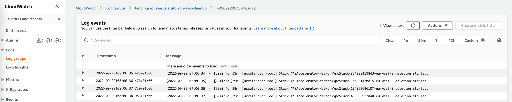

# Overview

This script is provide to automate the uninstallation of the Landing Zone Accelerator on AWS solution.

PLEASE NOTE THIS IS HIGHLY DESTRUCTIVE ACTION.

RUNNING THIS PROCESS WIL DESTROY ALL COMPONENTS OF LANDING ZONE ACCELERATOR AND THE RESOURCES IT DEPLOYED SUCH AS SECURITY SERVICE CONFIGURAITON AND NETWORKING!

The CloudFormation script:

- creates a VPC
- deploys an EC2 instance
- installs all the required prerequisite packages
- runs the un-installation command for Landing Zone Accelerator on AWS

# Running the script

The CloudFormation script must be run from the management account and home region where Landing Zone Accelerator on AWS was deployed.

The script expects two inputs:

| **Parameter Name** | **Description** | **Default** |
|:---------------|:---------------|:---------------|
|LandingZoneAcceleratorStackName|The name you gave the Landing Zone Accelerator on AWS installation stack when you deployed the solution.|AWSAccelerator-InstallerStack|
|LatestAmiId|You are unlikely to need to change this unless you are developing updates to the script. This value is systems manager key used to look up tyhe latest AMI to be used when deploying the EC2 instance.|/aws/service/ami-amazon-linux-latest/amzn2-ami-hvm-x86_64-gp2|
|DeleteInstallerStack|If set to true this will remove the original installer stack you deployed to setup the Landing Zone Accelerator on AWS. If set to false the stack will remain, allowing you to re-run the AWSAccelerator-Installer pipeline to redeploy your landing zone configuration|true|
|DeleteConfigRepository|If set to true this will remove your Landing Zone Accelerator on AWS configuration repository. If set to false the repository will remain.|true|
|RunNumber|This enables the ability to re-run the cleanup. If your cleanup fails, for example you accidently left resources deployed in a VPC preventing a VPC being deleted, you can correct the error, update the satck incrementing the RunNumber by one. This will re-run the cleanup picking up from where it left off.|1|

1. Sign in to the AWS Management Console of your organization’s management account and select the button to launch the Landing-zone-accelerator-on-aws-cleanup AWS CloudFormation template. The template will create a nested CloudFormation to setup the VPC. It will then deploy the EC2 instance and undertake the uninstallation. Whilst the uninstallation is running the CloudFormation template will remain in the **CREATE_IN_PROGRESS** stage.
2. To monitor the progress of the uninstallation open the CloudWatch console, from the left hand menu open the **Log groups** page and search for **landing-zone-accelerator-on-aws-cleanup**. *Note: it might take a few minutes for the log group to appear*
3. Select the latest instance ID log stream. Here you will see the progress of the uninstallation.



4. When the uninstallation is complete (which may take over an hour), the stack status will change to **CREATE_COMPLETE** and the last line in the log group should read (if it doesn't see the troubleshooting section below):


*Note: AWSAccelerator-InstallerStack will be the name you gave to your installation stack when deploying Landing Zone Accelerator on AWS.

5. You can now delete the cleanup up stack from CloudFormation.

# Troubleshooting

If the uninstallation fails you will receive a message similar to the following in the log stream.


You can use the logs to troubleshoot the issue and attempt any manual corrections based on the error messages.
To retry the uninstallation you can update the stack incrementing the RunNumber parameter by one which will retry the uninstallation.

Additionally, is also possible to access the instance via Systems manager sessions manager. You can follow [these](https://docs.aws.amazon.com/AWSEC2/latest/UserGuide/session-manager.html) instructions to get access to the instance.

Once you have shell access you can run the following commands manually to run the uninstallation to debug:

```
sudo -i
cd /root/landing-zone-accelerator-on-aws/source/packages/@aws-accelerator/tools/
yarn run --verbose ts-node --transpile-only uninstaller.ts --installer-stack-name <REPLACE_WITH_YOUR_INSTALLER_STACK_NAME> --ignore-termination-protection true --full-destroy true --installer-delete <REPLACE_WITH_true_OR_false> --delete-config-repo <REPLACE_WITH_true_OR_false> --partition aws --delete-data --ignore-termination-protection --delete-bootstraps true --delete-pipelines
```